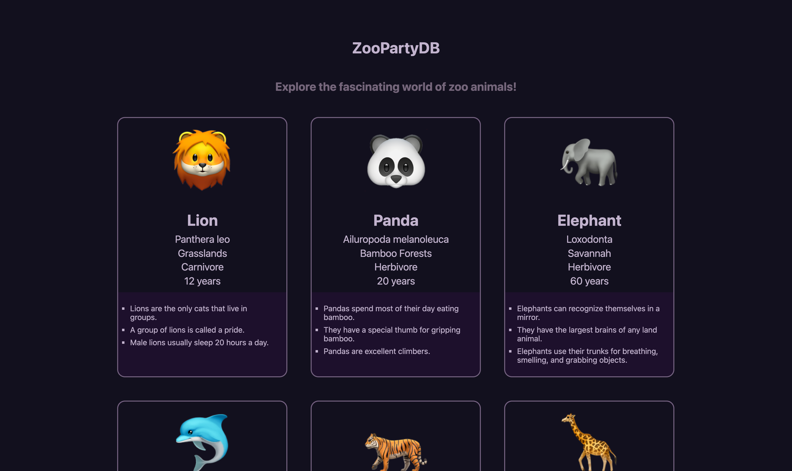

# Project 🦁ZooPartyDB🦧

A practical project for Supercode Fullstack Web-Dev Bootcamp.
in This project the Developer has been given an Array with objects of Animals and should use Props and Map Method to create the cards and show it in the web App using React.

## Demo

You can check the result out in the following video:

https://youtu.be/WIlQ0ItdbDs

## Deployment

To deploy this project click the link below

https://celadon-seahorse-a0cf2d.netlify.app/

## Tech Stack

**Client:** HTML, SCSS, Javascript, rect, Vite

**Server/Deployment:** Netlify

## Authors

- [@Samuel Aliyari](https://github.com/samuelaliyari)

## Screenshots

## Upcoming Features

🚧 Search bar

🚧 Sort Function 

🚧 maybe link to some Videos or more info external Pages
